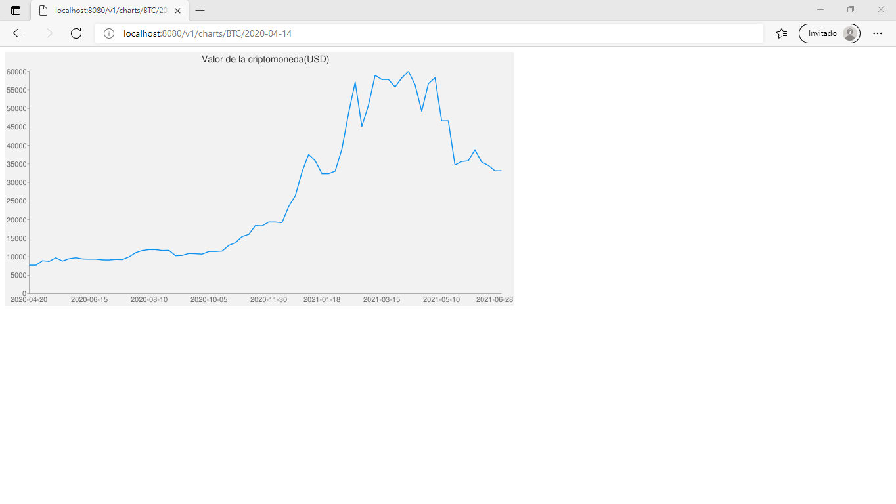
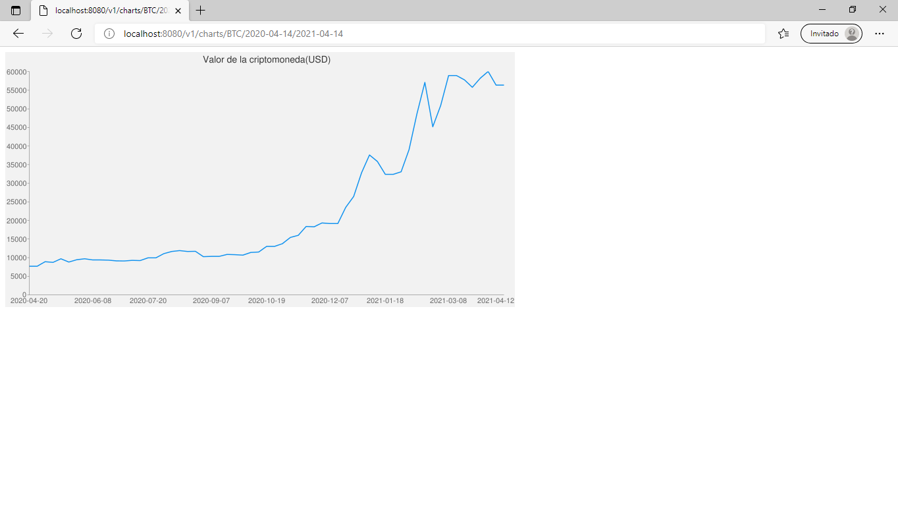

# API EDweek

API que devuelve u grafico con la evolución del valor monetario de una criptomoneda en especifico.

Realizado para el EDweek 2021.
Primera ves que participo ^w^

## Preparando el consumo.

En primer lugar debes de realizar la solicitud de tu *key* en la página https://nomics.com para poder hacer uso de su API. Una vez obtenida, solo es cuestión de editar el archivo `handler/handler.go`.

```go
package handler

const (
	key       = ""
	urlNomics = "https://api.nomics.com/v1/currencies/sparkline?key=" + key
	timeZone  = "T00%3A00%3A00Z"
)
```

## Realizar las peticiones.

El link para realizar las peticiones es: `servidor::puerto/v1/charts`

### Parámetros

Para realizar las peticiones se deben pasar dos parámetros obligatorios: el identificador de la criptomoneda, y la fecha de inicio desde donde se quiere empezar la consulta.
Por otro lado, también se puede colocar una fecha de finalización de la consulta para de esta forma conseguir un grafico con un rango personalizable.

Se colocan en el siguiente formato:

- idCripto (obligatorio) = BTC
- Fecha de inicio (obligatorio) = 2020-04-14
- Fecha de finalización(sino se coloca por defecto es la fecha actual) = 2021-04-14

**Nota:** Se colocan como parámetros de URI, y no como Query Params

## Ejemplos:

### Consulta de cierta fecha hasta la actualidad del valor del Bitcoin  

`http://localhost:8080/v1/charts/BTC/2020-04-14`

Resultado:




### Consulta del valor del bitcoin en un rango de tiempo (2020-04-14 a 2021-04-14)

`http://localhost:8080/v1/charts/BTC/2020-04-14/2021-04-14`

Resultado:

